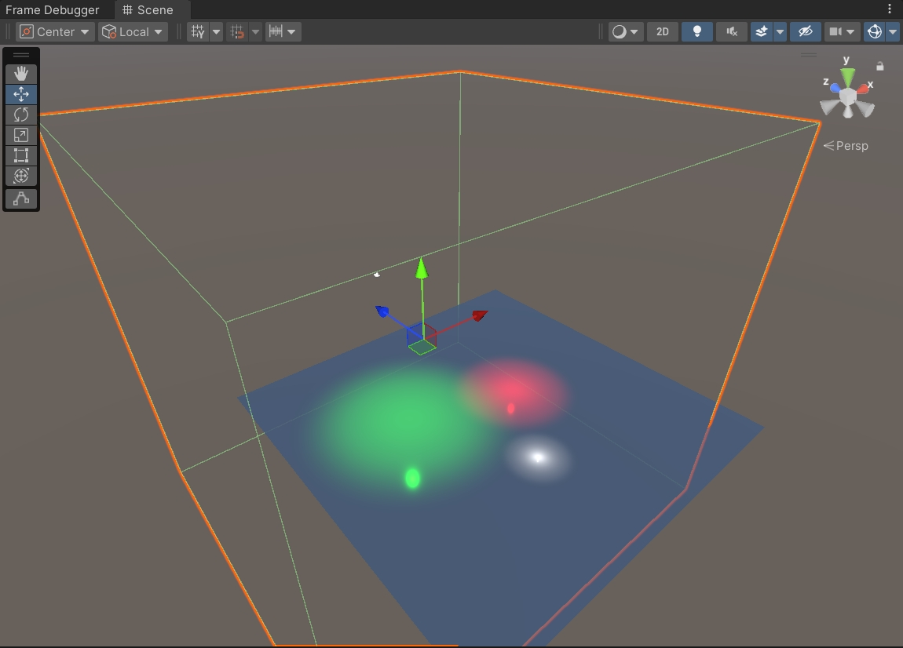
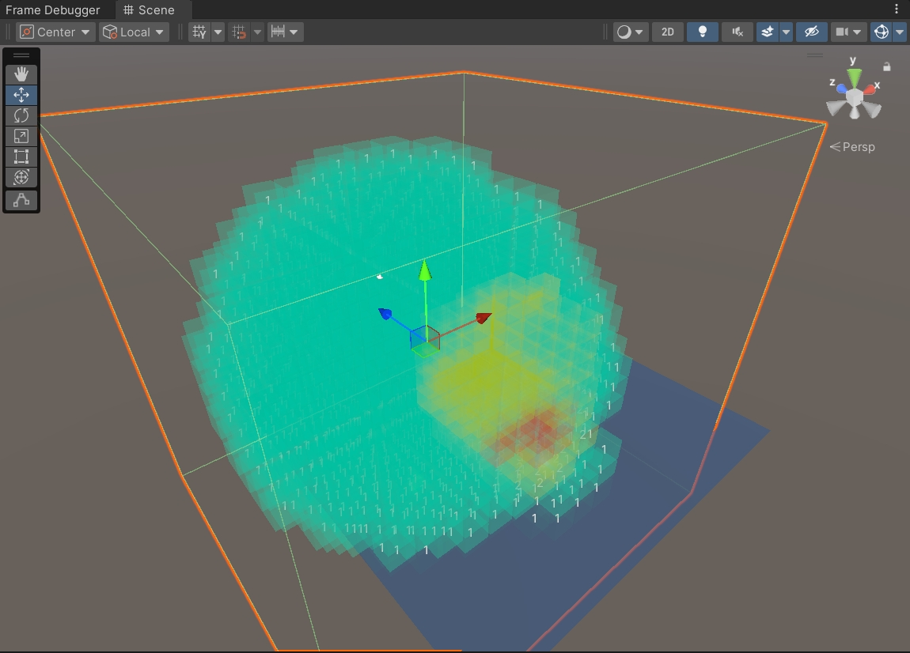

[English Version](README.md)

# Clustered Forward Lighting

基于 Unity Built-in Render Pipeline 的 Clustered Forward Lighting 实现，将 3D 场景空间划分为均匀网格，预计算每个 Cell 内影响的光源，运行时只计算必要的光源贡献，支持大量 Point Light 的高效渲染。

## 效果展示




## 系统架构

### 烘焙管线（Editor）

在编辑器中收集场景 Point Light，生成 3D Grid 配置，通过两阶段相交测试（粗略 AABB 裁剪 + 精确 Sphere-AABB）将光源分配到 Cell，最终编码为 `ClusterBakeAsset`（ScriptableObject）。

### 内联数据布局（GPU 优化）

传统 Clustered Lighting 使用三级间接寻址 Cell → LightIndices → LightData，每次光源访问需要两次不连续的 buffer 跳转。本项目将光源数据按 Cell 线性顺序平铺到两个并行 `StructuredBuffer` 中，同一 Cell 的光源在显存中物理连续，同一 warp 内相邻像素大概率命中同一段 cache line。代价是同一光源影响多个 Cell 时数据重复存储，以空间换带宽。

```
_ClusterCells:                  [Cell0, Cell1, Cell2, ...]
_ClusterInlinedLightsPosRange:  [C0.L0, C0.L1, | C1.L0, | C2.L0, C2.L1, C2.L2, | ...]
_ClusterInlinedLightsColorInt:  [C0.L0, C0.L1, | C1.L0, | C2.L0, C2.L1, C2.L2, | ...]
```

### Runtime

`ClusterLightingManager`（标记 `[ExecuteInEditMode]`）在 `OnEnable` 时将烘焙数据上传至 GPU ComputeBuffer 并设置 Shader 全局变量，编辑器非运行模式下也可预览光照效果。

### Shader

提供两套光照模型：

- `ClusterLighting.hlsl` — 简化 Blinn-Phong（Lambert 漫反射 + Blinn 镜面反射 + 平滑距离衰减）
- `ClusterLighting1.hlsl` — Unity Standard PBS（GGX NDF + Smith Visibility + Disney Diffuse），支持 Linear / Exponential / Inverse Square 三种衰减模式，从 G-Buffer 读取材质属性

## 渲染管线

```
Scene Point Lights
  → ClusterLightCollector（收集、过滤）
  → ClusterGridGenerator（生成 Grid 配置）
  → LightClusterAssigner（两阶段相交测试，分配光源到 Cell）
  → ClusterDataEncoder（编码 + 内联光源数据平铺）
  → ClusterBakeAsset（序列化保存）
  → ClusterGPUUploader（上传 ComputeBuffer + 设置全局变量）
  → Shader（单次寻址读取内联光源数据，计算光照）
```

## 目录结构

```
Assets/
├── Runtime/
│   ├── Core/                        核心数据结构
│   │   ├── ClusterStructs.cs        ClusterGridConfig, ClusterCell, BakedLightData
│   │   ├── ClusterBakeAsset.cs      ScriptableObject 烘焙资产
│   │   └── ClusterMath.cs           坐标转换、Sphere-AABB 相交测试
│   ├── Builder/                     构建管线
│   │   ├── ClusterGridGenerator.cs  Grid 生成与验证
│   │   ├── LightClusterAssigner.cs  光源-Cell 分配
│   │   └── ClusterDataEncoder.cs    数据编码、内联布局生成
│   ├── ClusterLightingManager.cs    Runtime 管理器（ExecuteInEditMode）
│   └── ClusterGPUUploader.cs        ComputeBuffer 创建与上传
├── Editor/
│   ├── Builder/
│   │   ├── ClusterLightCollector.cs 场景光源收集
│   │   ├── ClusterBuilder.cs        烘焙流程编排
│   │   └── ClusterBakerWindow.cs    Editor 窗口 UI
│   └── Debug/
│       ├── ClusterDebugRenderer.cs  Gizmos 绘制
│       └── ClusterDebugVisualizer.cs Scene View 可视化组件
└── Shaders/
    ├── ClusterLookup.hlsl           GPU 端 Grid 查找
    ├── ClusterLighting.hlsl         Blinn-Phong 光照
    ├── ClusterLighting.shader       基础 Cluster Lighting Shader
    ├── ClusterLighting1.hlsl        GGX PBS 光照
    ├── ClusterLighting1.shader      Deferred G-Buffer 采样版本
    └── ClusterLightingCube.shader   Cube 体积代理版本（Cull Front）
```

## 环境要求

- Unity 2021.3+
- Built-in Render Pipeline
- 支持 StructuredBuffer 的平台

## 使用方式

1. 场景中放置 Point Light
2. `Window → Cluster Lighting → Baker`，配置 Grid 参数后点击 Bake，保存 Asset
3. 场景中添加 `ClusterLightingManager` 组件，拖入 Bake Asset
4. 材质使用 `Recreate/ClusterLighting1` 或 `Unlit/ClusterLighting` Shader

## 已知限制

- 仅支持 Point Light（Spot / Directional 需要不同的相交算法）
- 光源数据为烘焙时静态快照，不支持运行时光源增删或移动
- 内联布局在光源密度高、Cell 数量大时显存占用会显著增长

## 许可

MIT
